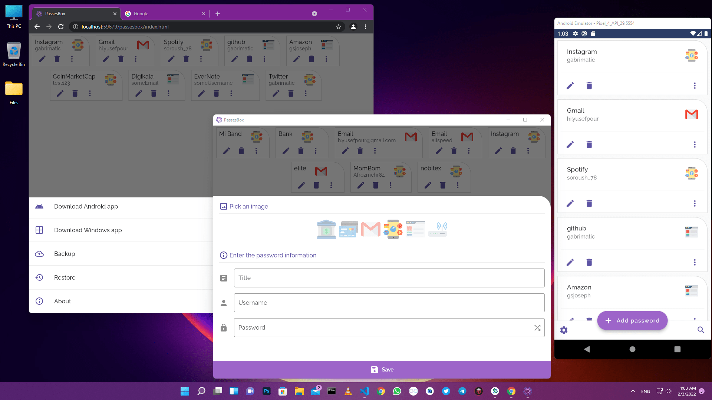

# PassesBox

[](LICENSE)
[](https://github.com/gabrimatic/passes_box/releases/latest)
[](https://github.com/gabrimatic/passes_box/releases/latest)
[](https://github.com/gabrimatic/passes_box/releases/latest)
[](https://github.com/gabrimatic/passes_box)
[](https://flutter.dev)
[](https://dart.dev)

**An offline-first password manager with AES-256 encryption, biometric access, and zero network dependency.**

PassesBox stores every credential you have, from social accounts to credit cards, in an encrypted local database. It generates strong passwords on demand, locks behind biometrics, and lets you carry your data across devices through encrypted backup files.

<p align="center">
  
</p>

---

## Features

- AES-256-CBC encryption with a random per-device key
- Random 16-byte IV generated per operation via `Random.secure()`
- Encrypted sembast database — all records are encrypted at rest
- Biometric authentication gate (fingerprint, Face ID) on mobile
- Cryptographically secure password generator (16-character, mixed charset)
- Encrypted backup and restore via `.pbb` files
- Entirely offline — no network calls, no telemetry, no tracking
- Cross-platform: Android, iOS, macOS, Web

---

## Platform Support

| Platform | Status | Notes |
|----------|--------|-------|
| Android | Supported | Biometric auth available |
| iOS | Supported | Biometric auth available |
| macOS | Supported | No biometric gate on desktop |
| Web | Supported | Key stored in localStorage; no biometric gate |
| Windows | Untested / Planned | Build compiles; not officially supported |

---

## Security

PassesBox never transmits data. Everything stays on device.

### Encryption architecture

- **Algorithm:** AES-256-CBC via the [`encrypt`](https://pub.dev/packages/encrypt) package
- **Key:** 256-bit key generated once with `Random.secure()`, stored in platform secure storage
- **IV:** 16 random bytes prepended to every ciphertext, unique per operation
- **Database:** sembast with a custom `SembastCodec` — every record is AES-encrypted before writing to disk
- **Backups:** `.pbb` files are AES-encrypted with the same device key before saving

No hardcoded keys. No static IVs. No plaintext at rest.

### Key storage by platform

| Platform | Storage mechanism |
|----------|------------------|
| iOS | Keychain via `flutter_secure_storage` |
| macOS | Keychain via `flutter_secure_storage` |
| Android | Android Keystore via `flutter_secure_storage` |
| Web | `localStorage` (browser-managed) |

> **Backup portability:** A `.pbb` file created on one device can only be restored on the same device (same key). Migrating to a new device requires re-exporting from the source device while the key is still accessible.

---

## Downloads

| Platform | Link |
|----------|------|
| Android | [GitHub Releases](https://github.com/gabrimatic/passes_box/releases/latest) |
| macOS | [GitHub Releases](https://github.com/gabrimatic/passes_box/releases/latest) |
| Windows | [GitHub Releases](https://github.com/gabrimatic/passes_box/releases/latest) |
| Web | [Build from source](#building-from-source) — run locally with `flutter run -d chrome` |

---

## Building from Source

```bash
git clone https://github.com/gabrimatic/passes_box.git
cd passes_box
flutter pub get
flutter run
```

### Platform-specific build commands

| Platform | Command |
|----------|---------|
| Android | `flutter build apk --release` |
| iOS | `flutter build ios --release` |
| macOS | `flutter build macos --release` |
| Web | `flutter build web --release` |

---

## Architecture

<details>
<summary>Project structure</summary>

```
lib/
├── main.dart
├── app.dart
├── core/
│   ├── models/
│   │   └── password.dart          # PasswordModel
│   ├── navigation/
│   │   ├── get_pages.dart
│   │   └── navigation.dart
│   ├── values/
│   │   ├── colors.dart
│   │   ├── strings.dart
│   │   └── values.dart
│   └── widgets/
│       └── widgets.dart
├── repository/
│   ├── db.dart                    # AES codec, PassesDB, key management
│   ├── db_factory_io.dart         # sembast factory for native
│   └── db_factory_web.dart        # sembast_web factory
└── src/
    ├── splash/
    │   └── view/page.dart         # biometric auth gate
    ├── home/
    │   ├── controller/
    │   │   ├── controller.dart    # GetX controller, CRUD
    │   │   └── io.dart            # backup / restore logic
    │   ├── dialogs/
    │   │   └── dialogs.dart       # password entry, settings, delete
    │   └── view/
    │       └── page.dart
    └── about/
        └── page/about_page.dart
```

</details>

---

## Troubleshooting

<details>
<summary>Biometric authentication not working</summary>

Biometric auth is only available on Android and iOS. On macOS and Web it is disabled by design. Make sure the device has at least one enrolled fingerprint or Face ID profile. The app checks `localAuth.isDeviceSupported()` at runtime and silently skips the auth gate if the device reports no support.

</details>

<details>
<summary>Backup restore fails or produces garbled data</summary>

`.pbb` files are encrypted with the device key at the time of export. Restoring on a different device, or after reinstalling the app (which regenerates the key), will fail with "Invalid or incompatible backup file." Always restore on the same device that created the backup, or export a new backup before reinstalling.

</details>

<details>
<summary>Web storage limitations</summary>

On Web, the encryption key is stored in `localStorage`. Clearing browser storage or switching browsers will make existing data inaccessible. Export a backup before clearing site data and restore after re-establishing the session in the same browser.

</details>

---

## Contributing

See [CONTRIBUTING.md](CONTRIBUTING.md) for guidelines.

---

## License

[MIT](LICENSE)

---

Created by [Soroush Yousefpour](https://gabrimatic.info)

<a href="https://www.buymeacoffee.com/gabrimatic" target="_blank"></a>
