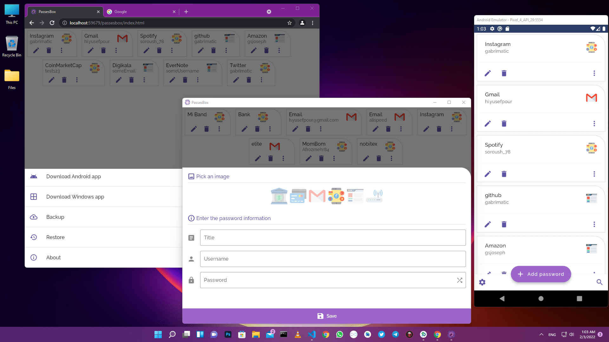

# PassesBox

[](LICENSE)
[](https://github.com/gabrimatic/passes_box/releases/latest)
[](https://github.com/gabrimatic/passes_box/releases/latest)
[](https://github.com/gabrimatic/passes_box/releases/latest)
[](https://github.com/gabrimatic/passes_box)
[](https://flutter.dev)
[](https://dart.dev)

Offline-first password manager with AES-256-GCM encryption and biometric access. No network dependency.

PassesBox stores credentials in an encrypted local database. It generates strong passwords on demand, locks behind biometrics on mobile, and supports encrypted `.pbb` backup files for moving data between devices.

<p align="center">
  
</p>

---

## Features

- AES-256-GCM authenticated encryption with a random per-device key
- Random 12-byte nonce per operation via `Random.secure()`; every ciphertext carries a 16-byte authentication tag
- Encrypted sembast database; records are encrypted and authenticated at rest
- Argon2id key derivation for all passphrase-protected exports (portable backup, QR)
- Biometric authentication gate (fingerprint, Face ID) on mobile
- Password generator (16 characters, mixed charset, cryptographically secure RNG)
- Clipboard auto-clear for copied passwords, password history entries, and TOTP codes
- Encrypted backup and restore via `.pbb` files (device key) and `.pbbx` files (user passphrase)
- Offline by default. No telemetry. Optional HIBP breach checks use k-anonymity and never send a full password hash.
- Cross-platform: Android, iOS, macOS, Web

---

## Platform Support

| Platform | Status | Notes |
|----------|--------|-------|
| Android | Supported | Biometric auth available |
| iOS | Supported | Biometric auth available |
| macOS | Supported | No biometric gate on desktop |
| Web | Supported | Key stored in localStorage; no biometric gate |
| Windows | Untested / Planned | Build compiles; not officially supported |

---

## Security

PassesBox does not transmit data. Everything stays on device.

### Encryption architecture

- **Algorithm:** AES-256-GCM (authenticated encryption). Every ciphertext has a 16-byte authentication tag — tampered or corrupted data is detected and rejected before decryption.
- **Key:** 256-bit key generated once with `Random.secure()`, stored in platform secure storage
- **Nonce:** 12 random bytes per operation, unique per record
- **Database:** sembast with a custom `SembastCodec`. Every record is AES-GCM encrypted before writing to disk.
- **Device backup (`.pbb`):** AES-GCM encrypted with the same device key; not portable across devices.
- **Portable backup (`.pbbx`):** AES-GCM encrypted with a key derived from a user passphrase via Argon2id (m=4096 KiB, t=3, p=1). Restorable on any device.
- **QR export (`pbbentry2:`):** Same Argon2id + AES-GCM scheme as the portable backup, per-entry.

No hardcoded keys. No static nonces. No unauthenticated ciphertext. No plaintext at rest.

### Key storage by platform

| Platform | Storage mechanism |
|----------|------------------|
| iOS | Keychain via `flutter_secure_storage` |
| macOS | Keychain via `flutter_secure_storage` |
| Android | Android Keystore via `flutter_secure_storage` |
| Web | `localStorage` (browser-managed) |

> **Backup portability:** A `.pbb` file created on one device can only be restored on the same device (same key). Migrating to a new device requires re-exporting from the source device while the key is still accessible.

---

## Downloads

| Platform | Link |
|----------|------|
| Android | [GitHub Releases](https://github.com/gabrimatic/passes_box/releases/latest) |
| macOS | [GitHub Releases](https://github.com/gabrimatic/passes_box/releases/latest) |
| Windows | [GitHub Releases](https://github.com/gabrimatic/passes_box/releases/latest) |
| Web | [Build from source](#building-from-source). Run locally with `flutter run -d chrome` |

---

## Building from Source

```bash
git clone https://github.com/gabrimatic/passes_box.git
cd passes_box
flutter pub get
flutter run
```

### Platform-specific build commands

| Platform | Command |
|----------|---------|
| Android | `flutter build apk --release` |
| iOS | `flutter build ios --release` |
| macOS | `flutter build macos --release` |
| Web | `flutter build web --release` |

---

## Architecture

<details>
<summary>Project structure</summary>

```
lib/
├── main.dart
├── app.dart
├── core/
│   ├── models/
│   │   └── password.dart          # PasswordModel
│   ├── navigation/
│   │   ├── get_pages.dart
│   │   └── navigation.dart
│   ├── values/
│   │   ├── colors.dart
│   │   ├── strings.dart
│   │   └── values.dart
│   └── widgets/
│       └── widgets.dart
├── repository/
│   ├── db.dart                    # AES codec, PassesDB, key management
│   ├── db_factory_io.dart         # sembast factory for native
│   └── db_factory_web.dart        # sembast_web factory
└── src/
    ├── splash/
    │   └── view/page.dart         # biometric auth gate
    ├── home/
    │   ├── controller/
    │   │   ├── controller.dart    # GetX controller, CRUD
    │   │   └── io.dart            # backup / restore logic
    │   ├── dialogs/
    │   │   └── dialogs.dart       # password entry, settings, delete
    │   └── view/
    │       └── page.dart
    └── about/
        └── page/about_page.dart
```

</details>

---

## Troubleshooting

<details>
<summary>Biometric authentication not working</summary>

Biometric auth is only available on Android and iOS. On macOS and Web it is disabled by design. Make sure the device has at least one enrolled fingerprint or Face ID profile. The app checks `localAuth.isDeviceSupported()` at runtime and silently skips the auth gate if the device reports no support.

</details>

<details>
<summary>Backup restore fails or produces garbled data</summary>

`.pbb` files are encrypted with the device key at the time of export. Restoring on a different device, or after reinstalling the app (which regenerates the key), will fail with "Invalid or incompatible backup file." Use a `.pbbx` portable backup (protected by a passphrase) to move data between devices. Always restore on the same device that created the `.pbb` backup, or export a portable backup before reinstalling.

</details>

<details>
<summary>Web storage limitations</summary>

On Web, the encryption key is stored in `localStorage`. Clearing browser storage or switching browsers will make existing data inaccessible. Export a backup before clearing site data and restore after re-establishing the session in the same browser.

</details>

---

## Contributing

See [CONTRIBUTING.md](CONTRIBUTING.md) for guidelines.

---

## License

[MIT](LICENSE)

---

Created by [Soroush Yousefpour](https://gabrimatic.info)

<a href="https://www.buymeacoffee.com/gabrimatic" target="_blank"></a>
